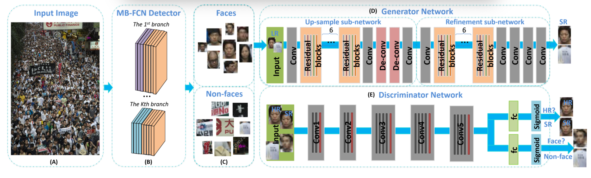

# Finding-Tiny-Faces-with-GAN

This is a reimplemetation of [1].



It uses python3, pytorch, and tensorboadX by default.

see [experiment.ipynb](./experiment.ipynb) for discription and result visulization.

# Pretrained weight
I've uploaded Pretrained SRGAN weight file to:

https://drive.google.com/open?id=1wfLQCXTR9YoxiWgkVoVw9NLHo4HO-jSL

Download it and put it in a new directory:
```mkdir -p Finding-Tiny-Faces-with-GAN/models```

# Training

```python train.py```

---

[1] Bai Y, Zhang Y, Ding M, et al. Finding tiny faces in the wild with generative adversarial network[C]//Proceedings of the IEEE Conference on Computer Vision and Pattern Recognition. 2018: 21-30.

[2] Ledig C, Theis L, Huszár F, et al. Photo-realistic single image super-resolution using a generative adversarial network[C]//Proceedings of the IEEE conference on computer vision and pattern recognition. 2017: 4681-4690.
